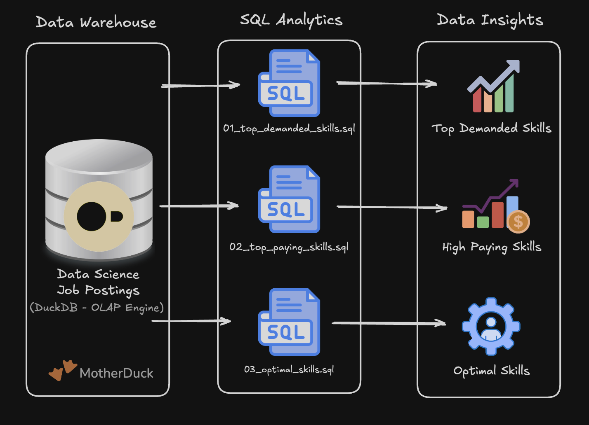

# 📊 Data Engineering Projects

A collection of hands-on data engineering projects designed to reinforce and apply core concepts from the ***SQL for Data Engineering course***. These projects demonstrate practical applications of SQL analytics, ETL pipelines, and dimensional modeling.

---

## 🔍 [Project 1: Hungarian Data Engineering Job Market Analysis (EDA)](/SQL_DATA_ENGINEERING_PROJECTS/Project_1-EDA/)

> *SQL-driven analysis of the Hungarian Data Engineering job market, exploring in-demand skills, salary trends, and the best combination of demand and earning potential.*

* **Core Skills:** Complex Joins, Advanced Aggregations, Window/Analytical Functions, Data Quality Validation, Ad-Hoc Reporting.

---

## 🏗️ [Project 2: Data Warehouse & Mart Build](/SQL_DATA_ENGINEERING_PROJECTS/Project_2-WH_DataMart/)

> *An end-to-end production ETL pipeline transforming raw CSV files from cloud storage into a normalized star schema data warehouse and purpose-built analytical data marts.*

* **Core Skills:** Dimensional Modeling (Star Schema), ETL Pipeline Development, Incremental Updates (UPSERT/MERGE), Data Mart Architecture, Production Orchestration.