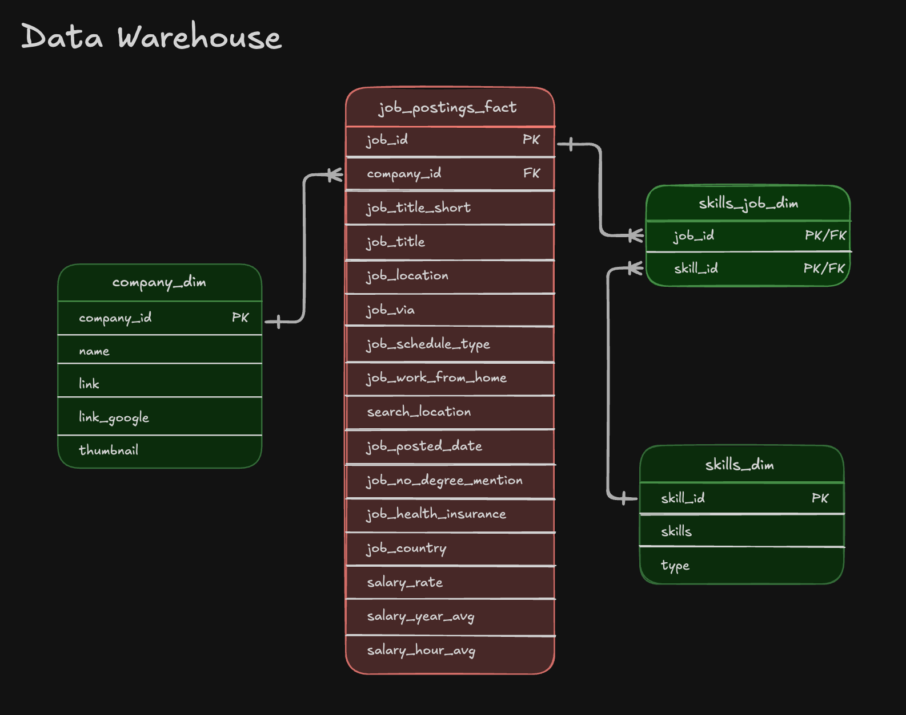
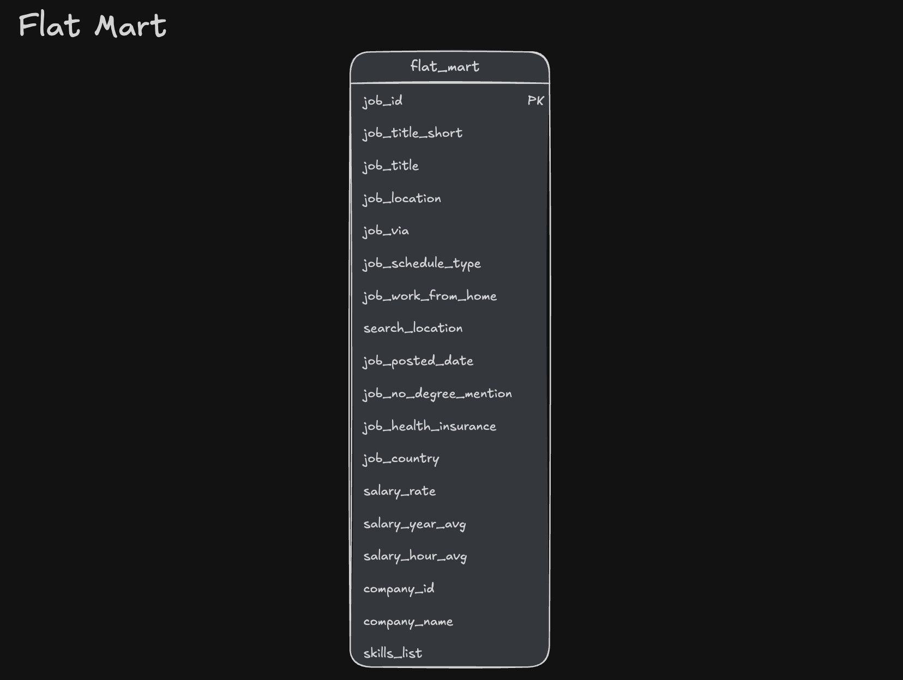
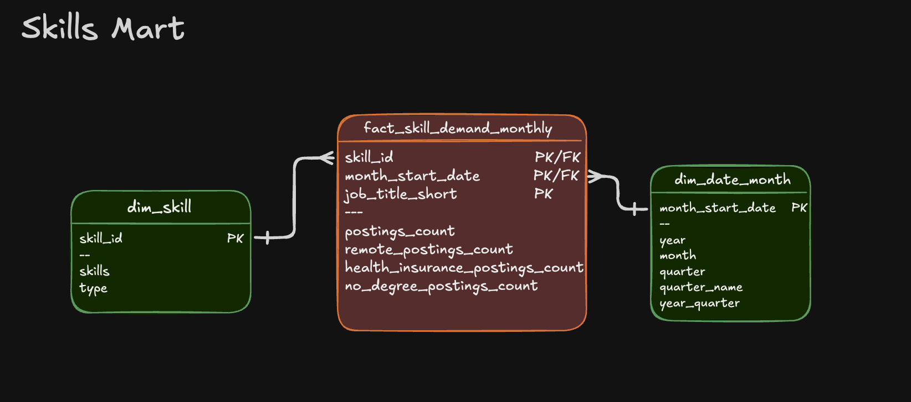
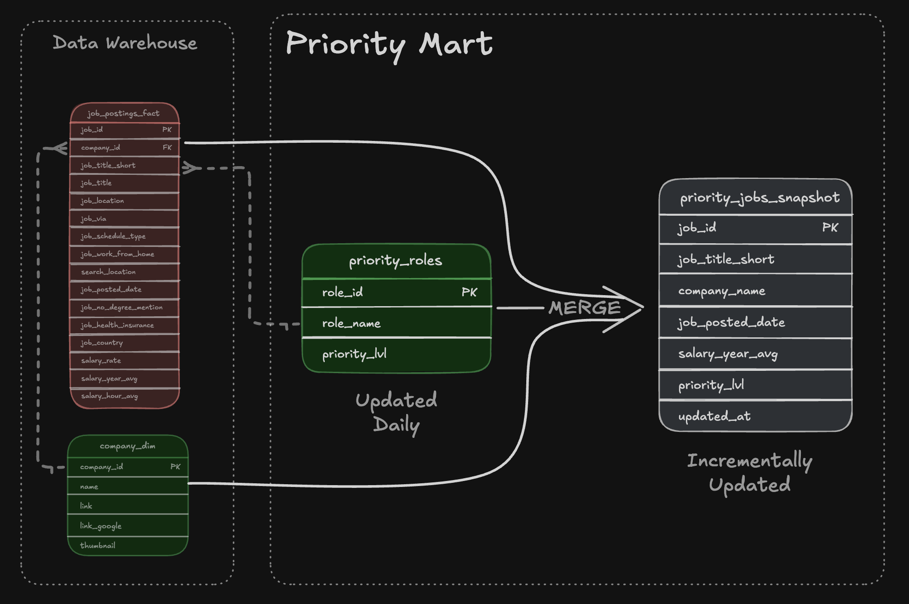

# 🏗️ Data Warehouse & Mart Build: Production ETL Pipeline

An end-to-end data engineering pipeline that transforms raw CSV files from Google Cloud Storage into a robust, normalized star schema data warehouse, powering specialized analytical data marts.


---

## 🧾 Executive Summary

- ✅ **End-to-End Pipeline:** Engineered a complete **ETL pipeline** migrating raw cloud storage data to a structured, analytics-ready environment.
- ✅ **Dimensional Modeling:** Designed a **star schema** architecture separating facts from dimensions, utilizing bridge tables for many-to-many relationships.
- ✅ **Robust ETL Processes:** Implemented **Extract, Transform, Load** workflows featuring idempotent operations, strict data type enforcement, and automated quality checks.
- ✅ **Specialized Data Marts:** Architected **domain-specific data marts** (Flat, Skills, Priority) using additive measures and production-grade incremental update patterns (`MERGE`).

---

## 🧩 Problem & Context

### The Challenge
Raw job posting data arrives as flat, denormalized CSV files in Google Cloud Storage. This format is heavily fragmented and inefficient for analytical queries. Business analysts struggle to extract reliable answers to core questions:
- *Which skills are most in-demand over time?*
- *What are the core hiring trends by location?*
- *How do salary patterns fluctuate across different roles and skill sets?*

Without a single source of truth, queries are expensive, slow, and prone to inconsistent results.

### The Solution
An automated, end-to-end ETL pipeline that:
1. **Extracts** raw CSVs directly from cloud storage.
2. **Normalizes** the data into a centralized star schema warehouse to ensure a single source of truth.
3. **Builds** specialized data marts that pre-aggregate and optimize data for specific downstream business use cases, drastically reducing BI tool query latency.

---

## 🧰 Tech Stack

- **Database:** DuckDB (High-performance OLAP engine with native GCS `httpfs` integration)
- **Language:** SQL (DDL for schema design, DML for transformations)
- **Data Model:** Star Schema (Fact, Dimension, and Bridge tables)
- **Storage:** Google Cloud Storage (GCS) for source data ingestion
- **Version Control:** Git & GitHub
- **Orchestration:** Master SQL build script execution via DuckDB CLI

---

## 📂 Repository Structure

```text
2_WH_Mart_Build/
├── 01_create_tables_dw.sql        # Core star schema DDL definitions
├── 02_load_schema_dw.sql          # GCS data extraction & warehouse loading
├── 03_create_flat_mart.sql        # Denormalized flat mart for ad-hoc BI
├── 04_create_skills_mart.sql      # Time-series skills demand mart
├── 05_create_priority_mart.sql    # Priority roles mart initial build
├── 06_update_priority_mart.sql    # Priority mart incremental updates (MERGE)
├── build_dw_marts.sql             # Master pipeline orchestration script
└── README.md                      # Project documentation
```

---

### Quick Start
You can execute the entire end-to-end pipeline using either the DuckDB CLI directly or the provided shell script.
**Option 1: Master script**
```bash
duckdb -c ".read build_warehouse.sql"
```

**Option 2: Shell script**
```bash
chmod +x build_warehouse.sh
./build_warehouse.sh
```
---

## 🏗️ Pipeline Architecture

The pipeline orchestrates the flow of job postings from Google Cloud Storage into a normalized data warehouse, followed by the generation of purpose-built analytical marts ready for BI consumption (Excel, Power BI, Tableau, Python).

### 1. Core Data Warehouse
Serves as the normalized single source of truth for all enterprise analytical queries.


* **Execution:** `01_create_tables_dw.sql` & `02_load_schema_dw.sql`
* **Design:** Star schema featuring `job_postings_fact`, `company_dim`, `skills_dim`, and `skills_job_dim`.
* **Grain:** One row per individual job posting in the fact table.

### 2. Flat Mart
A wide, fully denormalized table designed for rapid, flexible ad-hoc querying by end-users.


* **Execution:** `03_create_flat_mart.sql`
* **Design:** All dimensions pre-joined to the fact table.
* **Grain:** One row per job posting with fully expanded dimension attributes.

### 3. Skills Mart
Optimized for time-series analysis to track fluctuating skill demands in the market.


* **Execution:** `04_create_skills_mart.sql`
* **Design:** Aggregated time-series data featuring purely additive measures (counts/sums) for safe downstream roll-ups.
* **Grain:** `skill_id` + `month_start_date` + `job_title_short`

### 4. Priority Mart
Tracks high-priority roles and jobs using advanced incremental update strategies.


* **Execution:** `05_create_priority_mart.sql` & `06_update_priority_mart.sql`
* **Design:** Implements production-ready upsert patterns (`INSERT`, `UPDATE`, `DELETE`).
* **Grain:** One row per job posting with an assigned priority tier.
* **Highlight:** Showcases the `MERGE` operation for efficient incremental data loading, avoiding expensive full-table overwrites.

---

## 💻 Data Engineering Skills Demonstrated

### ETL Pipeline Development
* **Cloud Extraction:** Direct, secure data ingestion from Google Cloud Storage using DuckDB's `httpfs` extension.
* **Robust Loading:** Implemented idempotent table creation (`DROP TABLE IF EXISTS`) ensuring safe, repeatable pipeline executions.
* **Incremental Updates:** Engineered UPSERT logic using `MERGE` statements to handle ongoing data mutations efficiently.
* **Orchestration:** Managed sequential execution and dependencies via a master orchestrator (`build_dw_marts.sql`).

### Dimensional Modeling
* **Star Schema Architecture:** Separated descriptive attributes (dimensions) from quantitative metrics (facts).
* **Many-to-Many Relationships:** Implemented bridge tables (e.g., `skills_job_dim`) to properly resolve complex entity relationships.
* **Precise Granularity:** Maintained strict grain definitions across different structural layers (e.g., individual posting vs. skill-month aggregations).
* **Additive Measures:** Built metrics strictly as counts and sums to prevent re-aggregation errors in BI tools.

### Advanced SQL Techniques
* **Complex DML:** Utilized `INSERT INTO ... SELECT` with explicit column mapping and type casting.
* **Upserts/MERGE:** Handled matched, unmatched, and source-missing scenarios natively within single `MERGE INTO` operations.
* **Temporal Parsing:** Leveraged `DATE_TRUNC('month')` and `EXTRACT` for robust temporal dimension creation.
* **Data Cleansing:** Applied `STRING_AGG`, `REPLACE`, and `CASE WHEN` logic to sanitize string fields and consolidate boolean flags (e.g., remote, health insurance).

### Production Data Quality Practices
* **Idempotency:** Guaranteed that running the pipeline multiple times yields the exact same state without duplicating data.
* **Type Safety:** Enforced rigid schema definitions (`VARCHAR`, `INTEGER`, `DOUBLE`, `BOOLEAN`, `TIMESTAMP`).
* **Namespace Isolation:** Logically separated data assets using dedicated schemas (`flat_mart`, `skills_mart`, `priority_mart`).
* **Validation:** Integrated verification queries throughout the execution sequence to guarantee data integrity before downstream consumption.
